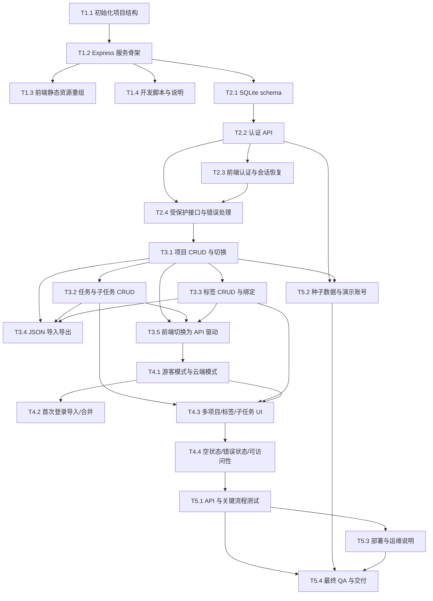

# 依赖关系图

```mermaid
graph TD
  T11[T1.1 初始化项目结构]
  T12[T1.2 Express 服务骨架]
  T13[T1.3 前端静态资源重组]
  T14[T1.4 开发脚本与说明]

  T21[T2.1 SQLite schema]
  T22[T2.2 认证 API]
  T23[T2.3 前端认证与会话恢复]
  T24[T2.4 受保护接口与错误处理]

  T31[T3.1 项目 CRUD 与切换]
  T32[T3.2 任务与子任务 CRUD]
  T33[T3.3 标签 CRUD 与绑定]
  T34[T3.4 JSON 导入导出]
  T35[T3.5 前端切换为 API 驱动]

  T41[T4.1 游客模式与云端模式]
  T42[T4.2 首次登录导入/合并]
  T43[T4.3 多项目/标签/子任务 UI]
  T44[T4.4 空状态/错误状态/可访问性]

  T51[T5.1 API 与关键流程测试]
  T52[T5.2 种子数据与演示账号]
  T53[T5.3 部署与运维说明]
  T54[T5.4 最终 QA 与交付]

  T11 --> T12
  T12 --> T13
  T12 --> T14

  T12 --> T21
  T21 --> T22
  T22 --> T23
  T22 --> T24
  T23 --> T24

  T24 --> T31
  T31 --> T32
  T31 --> T33
  T31 --> T34
  T31 --> T35
  T32 --> T34
  T33 --> T34
  T32 --> T35
  T33 --> T35

  T35 --> T41
  T41 --> T42
  T32 --> T43
  T33 --> T43
  T41 --> T43
  T43 --> T44

  T44 --> T51
  T22 --> T52
  T31 --> T52
  T51 --> T53
  T51 --> T54
  T52 --> T54
  T53 --> T54
```

## 阶段依赖结论

- Phase 1 是所有工作的底座，不能跳过。
- Phase 2 必须在数据库和认证边界稳定后才能推进领域 API。
- Phase 3 是产品能力的主体，Phase 4 的同步和 UI 扩展依赖它完成。
- Phase 5 不能只做文档，必须建立最少可用的自动化验证，否则回归风险过高。
